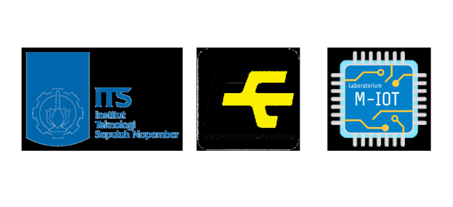

[](https://www.agungg.com/)

# YOLOv8 Based Human Tracking System for Autonomous Wheelchairs. (Sistem Pelacakan Manusia Berbasis YOLOv8 untuk Kursi Roda Otonom.)


Same as the previous project but for human tracking, requested by Dr. Eko Mulyanto Yuniarno,S.T.,M.T

Combining YOLOV8 and pose landmark, the screen is divided into 3 sections to determine the position of the human. If the bounding box is detected in the left partition, it will turn right, and vice versa, if the bounding box is detected in the right partition, it will turn left, ensuring the human remains in the center. If the human is within a distance of less than 1 meter, it will stop.

## Acknowledgements

```bash
  Coniuncti sumus quod hostes non sunt.
```

## Project Result

In this project, a test was conducted at Tower 2 with a scenario that involved navigating the area around Tower 2. The wheelchair followed a path from the second floor to the elevator and then exited toward the parking area. The following video shows the results of this test :


Based on the test results, the following conclusions can be drawn:


- The wheelchair successfully followed the human from the second floor to the elevator and all the way to the parking area without any issues.

## Installation
Actually, you need an ESP32 and the wheelchair to run it.

```bash
  python --version
  python -m venv nama_venv
  nama_venv\Scripts\activate
  pip install mediapipe
  pip install ultralytics
  pip install opencv-python
```
## Contributing

I am open to contributions and collaboration. If you would like to contribute, please create a pull request or contact me directly!
- Fork this repo.
- Create a new feature branch:

```bash
git checkout -b new-feature
```

- Commit your changes.
```bash
git commit -m "ver..."
```

- Push to the branch:
```bash
git push origin new-feature
```

## Features

- Automatic anti-collision safety feature, when the detected human is within 1 meter.
- Two speed modes: when going downhill, it will send a delay with each command sent, while in default mode, it uses the standard speed. 🚀

<p align="center">
  
</p>

## Authors


## License


